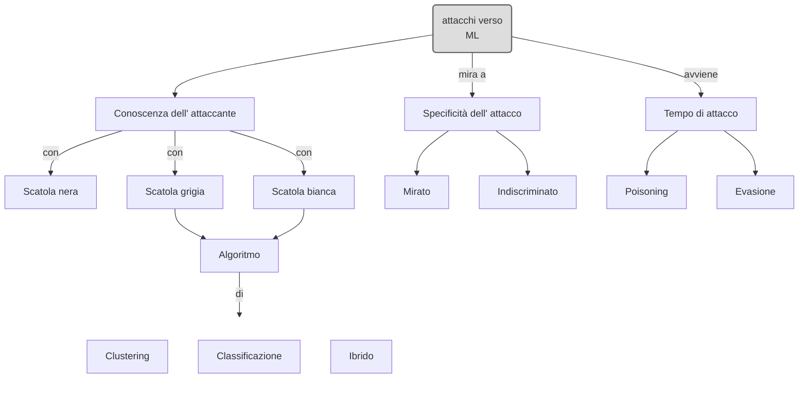

```mermaid
graph TD
    %% Define Main Nodes
    AAML(attacchi verso<br> ML)

    %% Preparation Branch
    AK[Conoscenza dell' attaccante]
    BB[Scatola nera]
    GB[Scatola grigia]
    WB[Scatola bianca]
    
    Algo[Algoritmo]
    

    
    %% Subgraph for Algorithm Types
    subgraph AlgoType [ ]
        direction TB
        Clus[Clustering]
        Clas[Classificazione]
        Hyb[Ibrido]
    end

    %% Manifestation Branch
    AS[Specificità dell' attacco]
    Targ[Mirato]
    Indis[Indiscriminato]
    
    AT[Tempo di attacco]
    Pois[Poisoning]
    Evas[Evasione]
    


    %% Define Connections
    AAML --> AK
    
    GB --> Algo
    WB --> Algo
    


    AK -- con --> BB
    AK -- con --> GB
    AK -- con --> WB
    
    Algo -- di --> AlgoType
    
   
    
    AAML-- mira a --> AS
    AAML --avviene--> AT

    
    AS --> Targ
    AS --> Indis
    
    AT --> Pois
    AT --> Evas
    
  

    %% Styling to match the image
    style AAML fill:#ddd,stroke:#666,stroke-width:2px

    style AlgoType fill:#fff,stroke:#fff


```